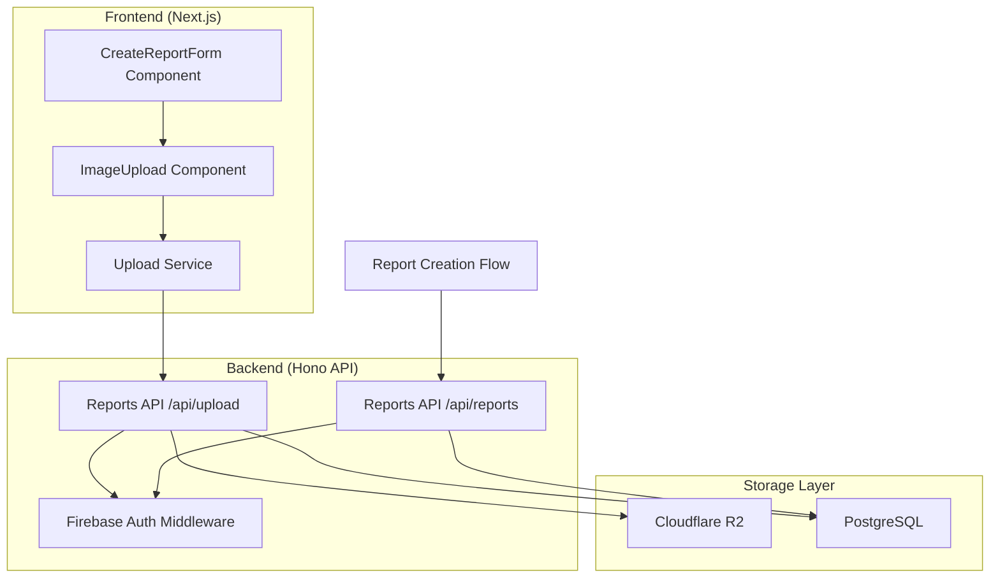

# Design Document

## Overview

The image upload system integrates with the existing report creation workflow to enable secure, efficient image uploads for road damage reports. The design follows a two-phase approach: MVP implementation using backend proxy uploads for immediate deployment, followed by an advanced version using presigned URLs for improved scalability.

The system leverages the existing architecture:

- **Frontend**: `CreateReportForm` component with `ImageUpload` component
- **Backend**: Reports API with new upload endpoint
- **Storage**: Cloudflare R2 for image storage
- **Database**: PostgreSQL for report metadata (including image URLs)

## Implementation Reference

For detailed implementation examples and code snippets, see: `docs/upload-design.md`

### Version 1 — MVP (Backend Proxy Upload)

- Frontend: `fetch('/api/upload', { method:'POST', body: FormData })`
- Backend: receives raw image, streams to R2, records metadata
- No conversion or presigned URLs

### Version 2 — Presigned URLs (Future)

- Frontend: WebP conversion + direct R2 upload via presigned URLs
- Backend: issues URLs, records metadata only
- Better scalability and performance

## Architecture

### System Components



### MVP Architecture (Version 1)

The MVP implementation uses a simple backend proxy approach where the frontend sends the raw image file to the backend, which then handles storage and returns the image URL.

**Data Flow:**

1. User selects image in `ImageUpload` component
2. Frontend validates file (size, type) before submission
3. On form submit, `CreateReportForm` sends complete report data including image file
4. Backend `/api/upload` endpoint processes image upload to R2
5. Backend creates report record with image URL
6. Frontend receives success response with report details

### Advanced Architecture (Version 2 - Future)

The advanced implementation uses presigned URLs for direct client-to-R2 uploads with WebP conversion.

**Data Flow:**

1. User selects image, frontend converts to WebP
2. Frontend requests presigned URL from `/api/upload/sign`
3. Frontend uploads directly to R2 using presigned URL
4. Frontend calls `/api/upload/complete` to finalize
5. Backend creates report record with confirmed image URL

## Components and Interfaces

### Frontend Components

#### ImageUpload Component

```typescript
interface ImageUploadProps {
  selectedImage: File | null;
  onImageSelect: (file: File) => void;
  onImageRemove: () => void;
  isUploading: boolean;
  error?: string;
  disabled?: boolean;
}
```

**Responsibilities:**

- File selection and validation (client-side)
- Image preview display
- Upload progress indication
- Error state management

#### CreateReportForm Component

```typescript
interface CreateReportFormProps {
  onSuccess?: (reportId: number) => void;
}
```

**Responsibilities:**

- Form state management using react-hook-form
- Integration with ImageUpload component
- Report submission orchestration
- Error handling and user feedback

### Backend Endpoints

#### MVP Upload Endpoint

```typescript
POST /api/upload
Content-Type: multipart/form-data
Authorization: Bearer <firebase-token>

Request Body: FormData with image file
Response: { imageUrl: string }
```

#### Advanced Upload Endpoints (V2)

```typescript
// Sign endpoint
POST /api/upload/sign
Content-Type: application/json
Authorization: Bearer <firebase-token>

Request: { fileName: string }
Response: { url: string, fileKey: string }

// Complete endpoint
POST /api/upload/complete
Content-Type: application/json
Authorization: Bearer <firebase-token>

Request: { fileKey: string, metadata: object }
Response: { imageUrl: string }
```

### Integration with Reports API

The image upload system integrates with the existing reports API structure:

```typescript
// Existing CreateReportSchema extended to handle images
interface CreateReportInput {
  street_name: string;
  category: string;
  location_text: string;
  image_url: string; // Populated by upload system
  lat?: number;
  lon?: number;
}
```

## Data Models

### Image Storage Schema

#### R2 Storage Structure

```
Bucket: viralkan-reports
Key Format: {user_id}/{uuid}_{timestamp}_{filename}
Example: 123/abc-def-ghi_1642678800000_damage.jpg
```

#### Database Schema (Existing)

```sql
-- Reports table already exists with image_url field
CREATE TABLE reports (
  id SERIAL PRIMARY KEY,
  user_id INTEGER NOT NULL,
  street_name VARCHAR(255) NOT NULL,
  category VARCHAR(50) NOT NULL,
  location_text TEXT NOT NULL,
  image_url TEXT, -- Stores R2 public URL
  image_key TEXT, -- Stores R2 object key for management
  lat DECIMAL(10, 8),
  lon DECIMAL(11, 8),
  status VARCHAR(20) DEFAULT 'pending',
  created_at TIMESTAMP DEFAULT CURRENT_TIMESTAMP,
  updated_at TIMESTAMP DEFAULT CURRENT_TIMESTAMP
);
```

### File Validation Rules

```typescript
interface FileValidationRules {
  maxSize: 10 * 1024 * 1024; // 10MB
  allowedTypes: ['image/jpeg', 'image/png', 'image/webp'];
  allowedExtensions: ['.jpg', '.jpeg', '.png', '.webp'];
}
```

## Error Handling

### Frontend Error States

1. **File Validation Errors**
   - File too large (>10MB)
   - Invalid file type
   - File selection cancelled

2. **Upload Errors**
   - Network connectivity issues
   - Authentication failures
   - Server-side processing errors

3. **Form Submission Errors**
   - Missing required fields
   - Backend validation failures
   - Database constraint violations

### Backend Error Responses

```typescript
interface ErrorResponse {
  error: {
    code: string;
    message: string;
    timestamp: string;
  };
}

// Error codes:
// - INVALID_FILE_TYPE
// - FILE_TOO_LARGE
// - UPLOAD_FAILED
// - UNAUTHORIZED
// - INTERNAL_ERROR
```

### Error Recovery Strategies

1. **Client-side validation** prevents most errors before upload
2. **Retry mechanisms** for network-related failures (V2)
3. **Graceful degradation** with clear user messaging
4. **Cleanup procedures** for failed uploads to prevent orphaned files

## Testing Strategy

### Unit Testing

#### Frontend Tests

- ImageUpload component behavior
- File validation logic
- Form integration testing
- Error state handling

#### Backend Tests

- Upload endpoint functionality
- Authentication middleware
- File processing logic
- Error response formatting

### Integration Testing

1. **End-to-end upload flow**
   - File selection → validation → upload → storage → response
2. **Authentication integration**
   - Valid token handling
   - Invalid token rejection
3. **Database integration**
   - Report creation with image URL
   - Constraint validation

### Performance Testing

1. **File size limits** (up to 10MB)
2. **Concurrent upload handling**
3. **Memory usage during file processing**
4. **R2 storage performance**

### Security Testing

1. **Authentication bypass attempts**
2. **File type validation bypass**
3. **Malicious file upload prevention**
4. **CORS configuration validation**

## Security Considerations

### Authentication & Authorization

- Firebase token validation on all upload endpoints
- User ID association with uploaded files
- Rate limiting per authenticated user

### File Validation

- Server-side file type validation (not just extension)
- File size limits enforced at multiple layers
- Malicious file content scanning (future enhancement)

### Storage Security

- R2 bucket access controls
- Public read access for image URLs
- Private write access through API only

### Data Privacy

- User-specific file organization in R2
- Secure deletion of orphaned files
- GDPR compliance for user data removal

## Performance Optimization

### MVP Optimizations

- Streaming file processing to avoid memory issues
- Efficient R2 upload using native APIs
- Connection pooling for database operations

### V2 Optimizations

- Client-side WebP conversion reduces file sizes
- Direct R2 uploads bypass server bandwidth
- Presigned URL caching for repeated operations
- Background orphan cleanup jobs

## Monitoring & Observability

### Metrics to Track

- Upload success/failure rates
- Average upload times
- File size distributions
- Error frequency by type
- Storage usage growth

### Logging Strategy

- Structured logging for upload events
- Error tracking with context
- Performance metrics collection
- Security event monitoring

### Alerting

- High error rates
- Storage quota approaching limits
- Authentication failures spike
- Performance degradation
