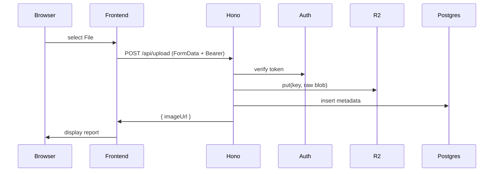
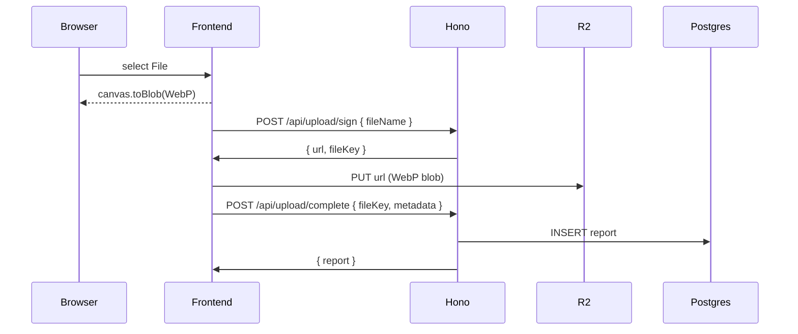

## R2 Upload System Design

### Version 1 — MVP (Backend Proxy Upload)

#### 1 — Overview

- Frontend: simple `fetch('/api/upload', { method:'POST', body: FormData })`
- Backend Hono: receives raw image, streams to R2, records metadata
- No conversion or presigned URLs

#### 2 — Components

- **Next.js Frontend**
  - File input → Server Action
  - `fetch('/api/upload')` with `FormData`

- **Hono API**
  - `/api/upload` (POST)
    - Auth middleware (Firebase)
    - `const file = await req.body().arrayBuffer()`
    - `await R2.put(key, file)`
    - `INSERT INTO reports(user_id, image_url)`

- **R2 Bucket**: stores original image blobs
- **PostgreSQL**: `reports(image_key, image_url, ...)`

#### 3 — Sequence (MVP)



#### 4 — Code Snippet (MVP)

```ts
// apps/api/src/routes/upload.ts
app.post("/api/upload", verifyToken, async (c) => {
  const data = await c.req.body({ type: "arrayBuffer" });
  const key = `${c.get("user_id")}/${crypto.randomUUID()}_${Date.now()}`;
  await R2.put(key, Buffer.from(data));
  const url = `https://${R2_ENDPOINT}/${key}`;
  await c.env.DB.query(
    `INSERT INTO reports(user_id, image_key, image_url) VALUES($1,$2,$3)`,
    [c.get("user_id"), key, url],
  );
  return c.json({ imageUrl: url });
});
```

#### 5 — Pros / Cons (MVP)

| Pros                                  | Cons                                       |
| ------------------------------------- | ------------------------------------------ |
| Easiest to implement; no client logic | VPS CPU & egress bottleneck; limited scale |
| Single endpoint; no CORS config       | No client feedback on progress; no retries |

---

### Version 2 — Presigned URLs with Frontend WebP Conversion

#### 1 — Overview

- Frontend: convert to WebP via canvas/WASM, then upload via presigned URL
- Backend: issues URL, records metadata only

#### 2 — Components

- **Next.js Frontend**
  - Canvas/WebAssembly → WebP blob
  - `POST /api/upload/sign` → `{ url, fileKey }`
  - `PUT url` → WebP blob to R2
  - `POST /api/upload/complete` → record metadata

- **Hono API**
  - `/api/upload/sign` (POST)
  - `/api/upload/complete` (POST)
  - Auth middleware

- **R2 Bucket**
- **PostgreSQL**

#### 3 — Sequence (v2)



#### 4 — Code Snippets (v2)

```ts
// sign
app.post("/api/upload/sign", verifyToken, async (c) => {
  const { fileName } = await c.req.json();
  const key = `${c.get("user_id")}/${crypto.randomUUID()}_${fileName}.webp`;
  const url = await R2.presignUrl(key, { method: "PUT", expires: 300 });
  return c.json({ url, fileKey: key });
});

// complete
app.post("/api/upload/complete", verifyToken, async (c) => {
  const { fileKey, category, street_name } = await c.req.json();
  const imageUrl = `https://${R2_ENDPOINT}/${fileKey}`;
  await c.env.DB.query(
    `INSERT INTO reports(user_id, image_key, image_url, category, street_name) VALUES($1,$2,$3,$4,$5)`,
    [c.get("user_id"), fileKey, imageUrl, category, street_name],
  );
  return c.json({ imageUrl });
});
```

#### 5 — Pros / Cons (v2)

| Pros                              | Cons                                  |
| --------------------------------- | ------------------------------------- |
| Offloads CPU & bandwidth from VPS | More client logic; CORS & auth config |
| Scales to large files & video     | Must handle orphan cleanup            |

---

### Orphan Cleanup (v2)

Daily cron in Hono:

```ts
const used = await DB.query("SELECT image_key FROM reports");
for await (const obj of R2.list()) {
  if (!used.rows.find((r) => r.image_key === obj.key)) {
    await R2.delete(obj.key);
  }
}
```

### Security & Validation

- Auth on all endpoints
- Validate `blob.size<=10MB`, `mimeType==='image/webp'`
- Rate‑limit uploads per user
- CORS restrict PUT to your origin

### Next Steps

1. Implement v1 for MVP launch
2. Build v2 frontend conversion UI
3. Deploy backend sign & complete endpoints
4. Add monitoring & metrics for upload success

## Implementation Status

### ✅ Completed (Task 1)

- Backend upload endpoint infrastructure with 4-layer architecture
- Database schema with uploads table and image_key field
- Environment configuration for R2 credentials
- OpenAPI documentation and route integration

### 🚧 In Progress

- Task 2: MVP image upload endpoint implementation
- Frontend upload service integration
- ImageUpload component enhancements

### 📋 Upcoming

- End-to-end testing
- Error handling improvements
- Performance monitoring
- V2 presigned URL implementation

## Environment Setup

### Development

```bash
R2_ACCESS_KEY_ID="your_r2_access_key"
R2_SECRET_ACCESS_KEY="your_r2_secret_key"
R2_BUCKET_NAME="viralkan-reports"
R2_ENDPOINT="https://account_id.r2.cloudflarestorage.com"
R2_PUBLIC_URL="https://pub-xxxxx.r2.dev"
```

### Production

```bash
R2_PUBLIC_URL="https://cdn.faldi.xyz"
```

## API Endpoints

### Current Implementation

- `POST /api/upload` - MVP file upload endpoint
- Authentication via Firebase JWT
- File validation (JPEG, PNG, WebP, max 10MB)
- Rate limiting (10 uploads/hour per user)

### Response Format

```json
{
  "imageUrl": "https://cdn.faldi.xyz/123/uuid_timestamp_image.jpg",
  "imageKey": "123/uuid_timestamp_image.jpg"
}
```

### Error Responses

```json
{
  "error": {
    "code": "FILE_TOO_LARGE",
    "message": "File size exceeds 10MB limit",
    "timestamp": "2025-01-20T10:30:00Z"
  }
}
```
