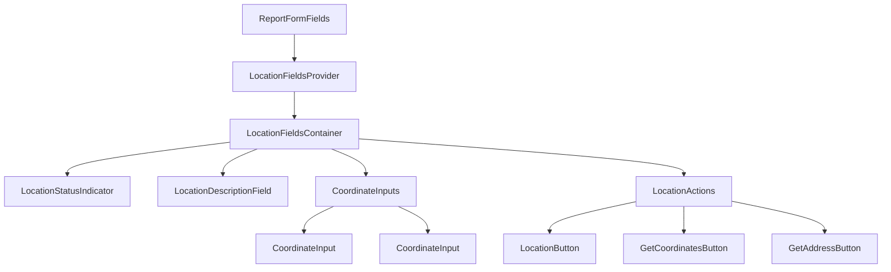

Perfect! Now let me provide you with a comprehensive refactoring plan for the ReportLocationFields component. Based on my analysis, I've identified several opportunities to make the code more reusable, follow KISS and DRY principles, and reduce prop drilling.

## 📋 **Refactoring Plan: ReportLocationFields Component**

### **Current Issues Identified:**

1. **Prop Drilling**: The component receives 13 props, making it tightly coupled
2. **Code Duplication**: Latitude and longitude inputs have nearly identical code
3. **Complex Conditional Logic**: Multiple nested conditions for different modes and states
4. **Large Component**: 276 lines handling multiple responsibilities
5. **Hard to Test**: Monolithic structure makes unit testing difficult

### **Proposed Solution Architecture:**



### **Detailed Refactoring Steps:**

#### **1. Create Shared Types & Interfaces**

- Consolidate all location-related props into a single interface
- Create enums for modes and geocoding states
- Define proper TypeScript types for all location operations

#### **2. Extract Location Status Indicator**

- Create `LocationStatusIndicator` component
- Handle EXIF data status display
- Make reusable across different contexts

#### **3. Create Custom Hook for Location Logic**

- `useLocationFields` hook to manage state and calculations
- Centralize form watching logic
- Handle coordinate validation and formatting

#### **4. Refactor Coordinate Inputs (DRY Principle)**

- Create reusable `CoordinateInput` component
- Eliminate code duplication between lat/lon fields
- Handle loading states and validation consistently

#### **5. Create Location Actions Component**

- Group all location-related buttons
- Handle progressive disclosure logic
- Simplify conditional rendering

#### **6. Implement Context Pattern**

- Create `LocationFieldsContext` to reduce prop drilling
- Provide location state and actions through context
- Maintain backward compatibility

#### **7. Update ReportFormFields Interface**

- Reduce props from 13 to 3-4 essential ones
- Use context for location-specific data
- Simplify component usage

### **Benefits of This Approach:**

✅ **KISS Principle**: Each component has a single, clear responsibility  
✅ **DRY Principle**: Eliminate code duplication in coordinate inputs  
✅ **Reusability**: Components can be used in different contexts  
✅ **Testability**: Smaller components are easier to unit test  
✅ **Maintainability**: Clear separation of concerns  
✅ **Type Safety**: Proper TypeScript interfaces throughout

### **File Structure After Refactoring:**

```
apps/web/components/reports/report-form/
├── fields/
│   ├── report-location-fields.tsx (simplified container)
│   ├── location-status-indicator.tsx
│   ├── location-description-field.tsx
│   ├── coordinate-input.tsx
│   └── location-actions.tsx
├── hooks/
│   └── use-location-fields.ts
├── context/
│   └── location-fields-context.tsx
└── types/
    └── location-fields.ts
```

### **Backward Compatibility:**

The refactoring will maintain the same external API while internally restructuring the components. This means no breaking changes for existing usage.

---

**Are you pleased with this plan?**

Would you like me to make any changes to the approach, or shall I proceed with the implementation? I can also adjust the balance between using context vs. compound components if you have a preference.
